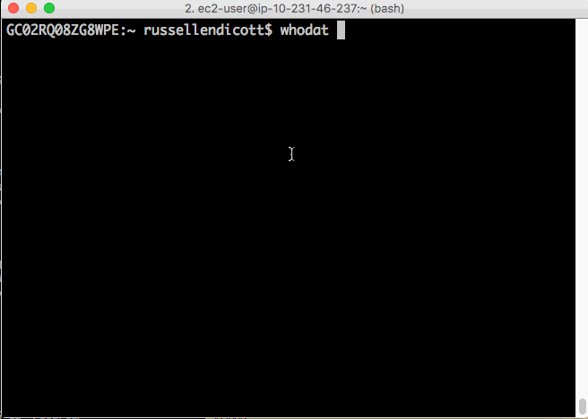

# whodat
Quick scripts to find out account info using the [Cloud Master Catalog API](https://github.build.ge.com/PublicCloudServices/cloud-master-catalog-api). Ask Jack or Jen for an API key and access to the repo.  Also has support for looking up a GE SSO with HR-US using `whodatpeep.sh`



## Installation
Download the .sh script and put it somewhere, make it executable, and add it as an alias to your `~/.bashrc`. Example below.

```bash
# cd to desired directory to put /whodat
git clone git@github.build.ge.com:503345432/whodat.git
cd whodat
echo alias whodat="$PWD/whodat/whodat.sh" >> ~/.bashrc
echo alias whodati="$PWD/whodat/whodati.sh" >> ~/.bashrc
echo alias whodatpeep="$PWD/whodat/whodatpeep.sh" >> ~/.bashrc
echo alias whodis="$PWD/whodat/whodis.sh" >> ~/.bashrc
source ~/.bashrc
```

## Usage
You must have proper API key files `.NAAPI_KEY`, `.CMC_KEY` & `.HRUS_KEY` respectively for CMC & HRUS call.  

## Aliases in .bashrc
```bash
# Execute once
echo alias whodat="$HOME/whodat/whodat.sh" >> $HOME/.bashrc
echo alias whodati="$HOME/whodat/whodati.sh" >> $HOME/.bashrc
echo alias whodatpeep="$HOME/whodat/whodatpeep.sh" >> $HOME/.bashrc
echo alias whodis="$HOME/whodat/whodis.sh" >> $HOME/.bashrc
echo alias whois="$HOME/whodat/whois.sh" >> $HOME/.bashrc

# Source bashrc
source ~/.bashrc
```
### whodat  
Run it with the account number or alias as the first argument and it will spit back data, add optional switch for `--owner` to get owners report too.  

```bash
# whodat ACCOUNT_ID | ACCOUNT_ALIAS [--brief] [--owner] 
whodat 188894168332 
```

Outcome:  
```bash
--- CMC Lookup for (188894168332) --------------------------------------------------------
{
  "connected_region": "us-east-1",
  "subtypes": [
    "Admin",
    "Standard"
  ],
  "provision_date": "2017-02-07  7:35:06 PM",
  "pop_locations": [
    "Ashburn"
  ],
  "status": "Active",
  "suspended_date": "UNKNOWN",
  "subtype": "Admin",
  "account_id": "188894168332",
  "vendor": "AWS",
  "business_unit": "Corporate CoreTech",
  "account_name": "digital-public-cloudops",
  "connected_regions": [
    "us-east-1"
  ],
  "owner": "212587208;200016241",
  "migration_date": "2019-12-18",
  "sku": "Guardrails Standard on AWS"
}

--- Active State -------------------------------------------------------------------------
  (188894168332) [digital-public-cloudops], at us-east-1 region, Migrated on 2019-12-18, Provisioned on 2017-02-07  7:35:06 PM
  SKU Guardrails Standard on AWS Owned by 212587208;200016241 from Corporate CoreTech
  ```

### whodatpeep  
Make sure your HR-US api key file named `.HRUS_KEY`. Use swithc `--brief` to get readable data with full json repirt. 
```bash 
whodatpeep 212606376 --brief
```

Interactive Outcome:  
```bash
--- US HR Lookup for (https://hr-us.gecloud.io/user?sso=212606376) -----------------------
  Person Info on 02-Nov-2023
------------------------------------------------------------------------------------------
  Status: I                                     Type  : Ex Employee
  SSO   : 212606376                             Title : Director - Architecture
  Name  : Paszkowski, Grant                     Comp. : General Electric Company
  eMail : null                                  Func. : Digital Technology
  Mobile: +1 (770) 3109351                      Role  : Corporate CoreTech & Cyber
  Start : 27-FEB-2017                           End   : 1-May-2022

WARNING: User Status is I! It must be 'A' as Active!
```

### whodis
CMC Lookup Accounts by SKU:  
```bash
whodis
```

Interactive Outcome:
```
## Assuming you entered 11 
### CMC Lookup Accounts By SKU ###########################################################
1) Quit                                    7) Guardrails Limited Commercial on AWS
2) Classic on AWS                          8) Guardrails Limited on AWS
3) Classic on AWS - Predix                 9) Guardrails Specialty on AWS
4) GovCloud                               10) Guardrails Standard on AWS
5) Guardrails GovCloud Limited on AWS     11) Managed Cloud - Nexus
6) Guardrails GovCloud Standard on AWS    12) Managed Cloud - Origin
Select 1 to Quit. Select a SKU #? 11
[
  ...
]
--- CMC Summary by SKU Managed Cloud - Nexus has 6 Accounts. Took .855849s ---------------
```